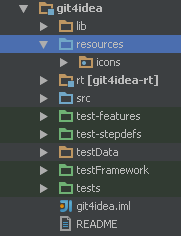

Icons and images are used widely by IntelliJ Platform plugins. Plugins need icons mostly for actions, custom components renderers, tool windows and so on. This page describes how to organize your work with icons and images under IntelliJ Platform.

## How to organize and how to use icons?

The best way to deal with icons and other image resources is to put them to a dedicated source root, say *"icons"* or *"resources"*.



The `getIcon()` method of [`com.intellij.openapi.util.IconLoader`](upsource:///platform/util/src/com/intellij/openapi/util/IconLoader.java) can be used to access the icons. Then define a class or an interface with icon constants in a top-level package called `icons`:

```java
public interface DemoPluginIcons {
  Icon STRUCTURE_TOOL_WINDOW = IconLoader.getIcon("/icons/toolWindowStructure.png");
  Icon MY_LANG_FILE_TYPE = IconLoader.getIcon("/icons/myLangFileType.png");
  Icon DEMO_ACTION = IconLoader.getIcon("/icons/demoAction.png");
}
```

Use these constants inside `plugin.xml` as well. Note that the package name `icons` will be automatically prefixed, and shouldn't be added manually.

```xml
<action id="DemoPlugin.DemoAction"
    class="com.jetbrains.demoplugin.actions.DemoAction"
    text="Demo Action"
    description="This is just a demo"
    icon="DemoPluginIcons.DEMO_ACTION"/>
```

### Image formats and naming notations

IntelliJ Platform supports Retina displays and has dark look and feel called Darcula. Thus, every icon should have a dedicated variant for Retina devices and Darcula look and feel, all variants should be in the same directory. In some cases you can skip `_dark` variants if the original icon looks good under Darcula.

Let's take a look on the example above. We've got three icons:

* for file type
* for an action
* and for a tool window.

All tool windows should have icon size of *13x13* pixels and all actions should have icon size of *16x16* pixels (tree nodes, file types and almost all icons have size 16x16 pixels).

* **iconName.png** W x H pixels (Will be used on non-Retina devices with default look and feel)
* **iconName@2x.png** 2\*W x 2\*H pixels (Will be used on Retina devices with default look and feel)
* **iconName_dark.png** W x H pixels (Will be used on non-Retina devices with Darcula look and feel)
* **iconName@2x_dark.png** 2\*W x 2\*H pixels (Will be used on Retina devices with Darcula look and feel)

The `IconLoader` class will load the icon that matches the best depending on the current environment.

Here are examples of *toolWindowStructure.png* icon representations:

| Look and feel   | File name                         | Image |
|-----------------|-----------------------------------|-------|
| Default         | `toolWindowStructure.png`         |  |
| Darcula         | `toolWindowStructure_dark.png`    |  |
| Default, retina | `toolWindowStructure@2x.png`      |  |
| Darcula, retina | `toolWindowStructure@2x_dark.png` |  |

